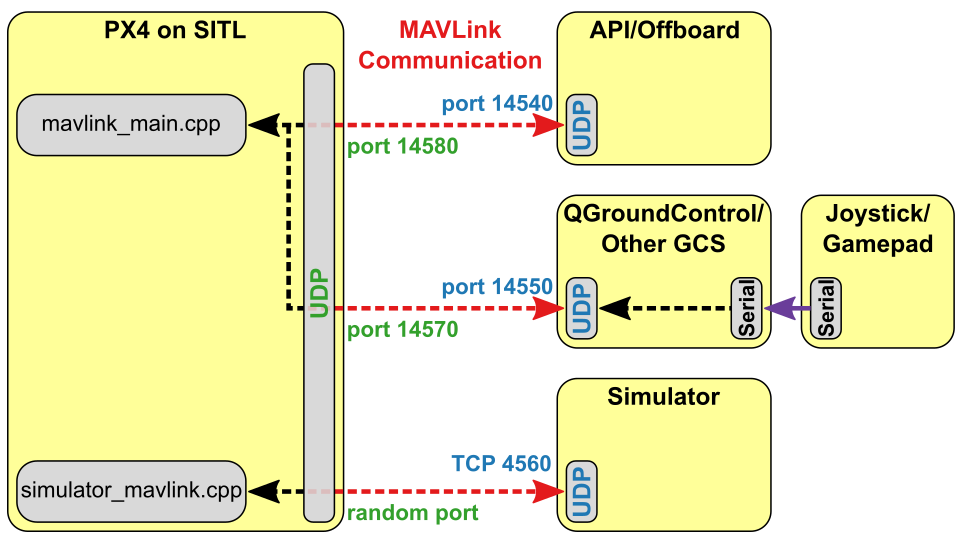
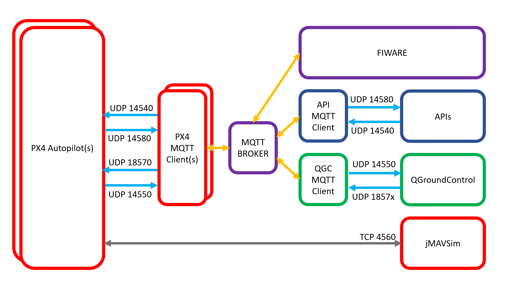

# Multi Vehicle Simulation Envirnoment
The goal of the following tools collection is to allow for the MAVLink communication to be done over MQTT instead of UDP or TCP, thus making over the internet drone management easier.
The implementation of the tools occours in the form of external script to be run aside of the specific MAVLink communicating instance (PX4, QGC, API, ecc)

## Original Communication Scheme


## MQTT based communication scheme


# Working Principle

## MAVLink Connection
MAVLink connection communicates by sending packets through UDP. The default receiving ports are 14550 for the ground control station and 18570 for the PX4-Autopilot. In case of multiple devices, at the QGC side, tha same receiving socket is used for all the incoming data, while the data is sent to the different instances through UDP ports 1857x (with x the instance number). In case of more than 10 devices, the UDP port 18579 is used for all the excedence.  
In order for a communication to be established between the ground control station and the device, a heartbeat stream must be sent by both sides.

## MAVLink Connection with PX4-Autopliots
A socket is created at the QGC side, listening for port 1857x (x the sim N) and sending on 14550 to QGC. 
The received message is published with the topic /(api-key)/0/qgc_to_px4_x, while mqtt messages received with topic /(api-key)/x/px4_to_qgc are sent over UDP 14550 to QGC. 
At the PX4 side, since all the PX4 instances are supposed to run on different devices, the mqtt received messages from QGC to PX4 are sent via UDP to port 18570, from the same socket that is listening on 14550 for PX4 to QGC packets. 
This way there is no need of modifying the default ports in PX4 simulators.
## MAVLink Connection with External Devices
If in the configuration file ENABLE_EDEV is set to True, the received messages with topic /(api-key)/10*/edev_to_px4 are received, the information contained in the plain text payload is decoded and saved.  
The payload structure is "lat|xx.yyy|lon|xx.yy|ele|xx.yyy|h|xx.yyy|v|xx.yyy|m|xx.yyy"

A pymavlink drone instance is created for every edev (to be set in the EDEV_N param), and every time an MQTT message is received, a GLOBAL_POSITION_INT Mavlink message is generated, along with a Heartbeat.
External devices are seen from QGC as FREE BALLOONS, so no errors will be displayed because of the unilateral communication.

## API 
If ENABLE_API is set to True in the PX4 config file, a communication is instanciated over MQTT to and from the ports 14540 and 14580 at the PX4 side, allowing to control in real time the mission from apis.
Live update of the fences is possible, and doesn't require mission to be halted.  


# Envirnoment Set-Up
## PX4 + jMAVSim setup
Requirements: Ubuntu 20.xx LTS, git, pip, paho-mqtt
- Clone PX4-Autopilot suite and run the setup tool
    ```
    git clone https://github.com/PX4/PX4-Autopilot.git --recursive
    bash ./PX4-Autopilot/Tools/setup/ubuntu.sh
    ```
- Clone MVSE Tools
    ```
    git clone https://github.com/FlexiGroBots-H2020/MVSE
    ```
- Copy content of /Tools/PX4 in /PX4-Autopilot/MQTT
- Edit empty_px4_conf.json to match instance value and MQTT address and credential and rename it px4_conf.json
- Open a terminal in /PX4-Autopilot and run px4_mqtt_client.py  
Make sure to  choose a free instance number
    ```
    python3 px4_mqtt_client.py
    ```
The script will edit the config files in the PX4 source and start the MQTT client, close it if you don't need to run the simulation.
## QGroundControl  fist setup
Requirements: git, pip, paho-mqtt, pymavlink  
(tested with Ubuntu 20.04 LTS, for different distributions commands may differ)
- In a terminal execute
    ```
    sudo usermod –a –G dialout $USER
    sudo apt-get remove modemmanger –y
    sudo apt install gstreamer1.0-plugins-bad gstreamer1.0-libav gstreamer1.0-gl –y
    ```
- Clone MVSE Tools
    ```
    git clone https://github.com/FlexiGroBots-H2020/MVSE
    ```
- In folder /Tools/QGC/ right-click on QGroundControl.AppImage -> Permissions -> Allow execute as a program
- In empty_qgc_conf.json, change values of DEV_N and QGC_INST accordingly to environment and rename to qgc_conf.json

# Simulation
## PX4 + jMAVSim Simulation
Open a terminal PX4-Autopilot and  PX4-Autopilot/MQTT

Start PX4-Autopilot and jMAVSim from /PX4-Autopilot/ terminal
```
make px4_sitl_default jmavsim
```

Start PX4 MQTT Client from /PX4-Autopilot/MQTT terminal
```
python3 /MQTT/px4_mqtt_client.py
```

## QGroundControl
Open two terminals in /MVSE/QGC  
Start QGroundControl
```
. QGroundControl.AppImage
```
Start QGC MQTT Client
```
python3 qgc_mqtt_client.py
```